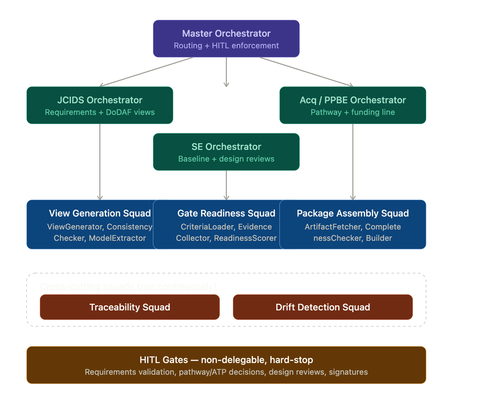
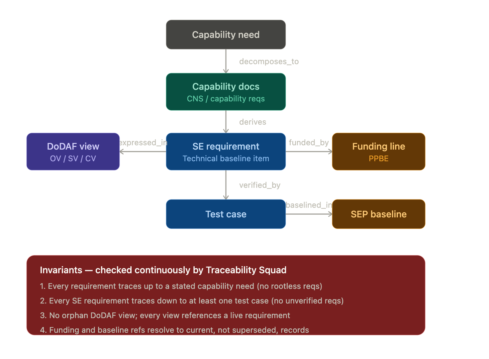

# Specification: Defense Acquisition Agentic Pipeline (DAAP)

> **Build target:** Claude Code implementation spec

> **Framework:** K9-AIF (K9 Agentic Integration Framework) — k9x.ai

> **Pattern:** Architecture-first, TOGAF-aligned, governed multi-agent with Human-in-the-Loop (HITL)

> **Status:** Draft v0.1 — author to confirm pathway, systems of record, and authority boundaries before build.

---

## 0. How to use this document

This is an architecture-first specification, not an implementation. It defines **what** the pipeline does, **where** humans must intervene, and **how** the agentic components decompose into K9-AIF building blocks. Implementation in Claude Code should proceed bottom-up: build and test individual SBBs, validate against the contracts here, then promote stable patterns to ABBs via the K9-AIF Continuum.

**Do not** automate any act designated as a validation/approval authority (Section 6). Those are agent-*prepared*, human-*decided*, by policy.

---

## 1. Problem statement

Defense capability development runs three concurrent, poorly-synchronized processes:

1.**JCIDS** (Joint Capabilities Integration and Development System) — requirements. Produces ICD → CDD → CPD, expressed using **DoDAF** architecture views. Validated by the JROC.

2.**Adaptive Acquisition Framework (AAF)** — the build/buy. Governed by DoDI 5000.02 with six pathways (Major Capability, Software, Urgent, Middle-Tier, Defense Business Systems, Services).

3.**PPBE** (Planning, Programming, Budgeting & Execution) — funding. Annual cycle, governs everything.

Systems Engineering (SE) runs *inside* the chosen acquisition pathway, governed by the SEP, executing technical reviews (SRR → SFR → PDR → CDR → TRR) that decompose requirements into a verifiable technical baseline.

The cost center is not "building the system" — it is the **document generation, cross-artifact traceability, gate-readiness assessment, and cross-process drift detection** that consumes analyst hours and is where errors compound. That is the automation surface.

> **Terminology note:** The statutory entity is the Department of Defense (DoD). "Department of War" is a proposed/secondary branding; use DoD in formal artifacts unless directed otherwise.

---

## 2. Scope

### 2.1 In scope (agent-automatable, HITL-gated)

- Requirements traceability graph (ICD → CDD → CPD → SE technical requirements → test cases)
- DoDAF view generation and cross-view consistency checking (OV, SV, CV families)
- Gate-readiness scoring against JCIDS / milestone / SE-review entry criteria
- Cross-process drift detection (JCIDS ↔ SEP baseline ↔ PPBE funding line)
- Artifact package assembly and completeness checks

### 2.2 Out of scope (human authority — never automated)

- JROC validation, milestone decisions, Authorities to Proceed (ATP)
- Any authoritative determination or signature act
- Classified requirements handling (unless a separately accredited enclave is defined)
- The act of *building* the system (program office + contractor responsibility)

### 2.3 Decisions required before build

1.**Which AAF pathway?** Software Acquisition Pathway and Major Capability Pathway produce different artifact sets and cadences. This changes the whole pipeline.

2.**Systems of record.** Authoritative connectors to DOORS / DOORS Next, Cameo/MagicDraw (or other SysML/MBSE tool), and PLM. No document scraping for source-of-truth data.

3.**Authority boundary.** Explicit, documented list of agent-prepared vs. human-decided acts. (See Section 6.)

---

## 3. Architecture (K9-AIF decomposition)

### 3.1 Compositional model

-**ABBs (Architecture Building Blocks):** stable, governed, reusable. Promoted from proven SBBs.

-**SBBs (Solution Building Blocks):** concrete implementations under active development.

-**Continuum:** governed promotion path SBB → ABB.

### 3.2 Orchestration topology

```

                         ┌─────────────────────────────┐

                         │   DAAP Master Orchestrator   │  (BaseOrchestrator)

                         │   - pathway-aware routing    │

                         │   - HITL gate enforcement    │

                         └───────────┬─────────────────┘

                                     │

        ┌────────────────────────────┼────────────────────────────┐

        │                            │                            │

┌───────▼─────────┐        ┌─────────▼─────────┐        ┌─────────▼─────────┐

│ JCIDS           │        │ SE Engineering    │        │ Acquisition/PPBE  │

│ Orchestrator    │        │ Orchestrator      │        │ Orchestrator      │

│ (BaseOrch.)     │        │ (BaseOrch.)       │        │ (BaseOrch.)       │

└───────┬─────────┘        └─────────┬─────────┘        └─────────┬─────────┘

        │                            │                            │

   ┌────▼────┐                 ┌─────▼─────┐                ┌─────▼─────┐

   │ Squads  │                 │  Squads   │                │  Squads   │

   └─────────┘                 └───────────┘                └───────────┘
```

### 3.3 Squads (BaseSquad) and their agents (BaseAgent)

| Squad | Owning Orchestrator | Core agents | Output |

|-------|--------------------|-------------|--------|

| **Traceability Squad** | Master (cross-cutting) | LinkProposer, LinkValidator, OrphanDetector, CoverageScorer | Trace graph + coverage report |

| **View Generation Squad** | JCIDS | ViewGenerator (OV-1/SV/CV), ViewConsistencyChecker, ModelExtractor | DoDAF views + incoherence flags |

| **Gate Readiness Squad** | per-process | CriteriaLoader, EvidenceCollector, ReadinessScorer, GapReporter | Gate-readiness score + gap list |

| **Drift Detection Squad** | Master (cross-cutting) | BaselineDiffer, FundingDiffer, DriftClassifier | Drift alerts with severity |

| **Package Assembly Squad** | per-process | ArtifactFetcher, CompletenessChecker, PackageBuilder | Review-ready artifact package |

### 3.4 Model routing

Use **ModelRouterFactory / K9ModelRouter** to route by task class:

-**Extraction / structured parsing** → smaller, fast, deterministic model (low temp).

-**Consistency reasoning / drift classification** → stronger reasoning model.

-**Narrative drafting (view descriptions, gap explanations)** → mid-tier with guardrail model (e.g. granite3-guardian-class) on the output path.

- Route classified-adjacent content only to accredited endpoints; otherwise hard-fail.

---

## 4. Data model

### 4.1 Canonical entities (graph — Neo4j, aligns with graph.k9x.ai)

-`CapabilityGap`, `ICD`, `CDD`, `CPD`

-`DoDAFView` (subtype: OV-1, SV-1, CV-2, …)

-`SERequirement`, `TechnicalBaselineItem`

-`TestCase`, `VerificationEvent`

-`GateCriterion`, `FundingLine`, `SEPBaseline`

### 4.2 Canonical relationships

-`(ICD)-[:DECOMPOSES_TO]->(CDD)-[:DECOMPOSES_TO]->(CPD)`

-`(CPD)-[:DERIVES]->(SERequirement)-[:VERIFIED_BY]->(TestCase)`

-`(SERequirement)-[:EXPRESSED_IN]->(DoDAFView)`

-`(SERequirement)-[:FUNDED_BY]->(FundingLine)`

-`(SERequirement)-[:BASELINED_IN]->(SEPBaseline)`

### 4.3 Trace invariants (checked continuously)

- Every CPD requirement traces upward to an ICD-stated gap.
- Every SE requirement traces downward to ≥1 test case (no unverified requirements).
- No orphan DoDAF view (every view references at least one live requirement).
- Funding and baseline references resolve to current, not superseded, records.

---

## 5. Pipeline stages

```

Capability gap

   │

   ▼ [JCIDS Orchestrator]

ICD / CDD / CPD  ──(DoDAF views via View Generation Squad)

   │  ⟢ HITL GATE 1: JROC validation prep → human validates

   ▼ [Acquisition Orchestrator]

Materiel Development Decision → pathway selection

   │  ⟢ HITL GATE 2: pathway/milestone decision → human decides

   ▼ [SE Orchestrator]

SE technical baseline + reviews (SRR→SFR→PDR→CDR→TRR)

   │  ⟢ HITL GATE 3..n: each SE review → human chairs/approves

   ▼

Build / integrate / test (DT&E, OT&E)   ← agents support, do not build

   │

   ▼

Production & Deployment → Sustainment
```

Cross-cutting throughout: **Traceability Squad** and **Drift Detection Squad** run continuously, not as a stage.

---

## 6. Human-in-the-Loop contract

HITL is modeled as **explicit governed gates**, not afterthoughts. Each gate is a first-class object.

```yaml

gate:

id: string# e.g. "JROC-VALIDATION"

type: enum[PREPARE_DECIDE, REVIEW_APPROVE, SIGN]

agent_role: PREPARE_ONLY# agents may assemble + score, never decide

human_role: DECISION_AUTHORITY

entry_criteria: [ ... ]    # what must be true to present to human

evidence_package: ref# what the agent assembled

human_actions: [APPROVE, REJECT, RETURN_FOR_REWORK]

audit: { who, when, rationale }   # mandatory, immutable

non_delegable: true# policy flag — pipeline must hard-stop here
```

**Rule:** any gate with `non_delegable: true` causes the orchestrator to halt and require a human token before continuing. No agent may synthesize or impersonate that token.

Non-delegable acts (minimum set): JROC validation, milestone/ATP decisions, SE review board approvals, any signature.

---

## 7. Connectors (authoritative sources only)

| Source system | Purpose | Mode |

|---------------|---------|------|

| DOORS / DOORS Next | Requirements of record | Read + write-back (proposed links staged for human) |

| Cameo / MagicDraw (SysML/MBSE) | Architecture + DoDAF model | Read; generate views from model |

| PLM | Technical baseline, CM | Read |

| PPBE/financial system | Funding lines | Read |

**Never** treat a scraped document as source of truth. Agents read authoritative records; all write-backs are staged as *proposals* pending HITL approval.

---

## 8. Governance, audit, safety

-**Immutable audit log** for every agent action and every human decision (who/when/why).

-**Provenance** on every generated artifact: which agent, which model, which source records, which gate cleared it.

-**Guardrail model on output paths** producing human-facing narrative or anything entering an official package.

-**Determinism where it matters:** extraction and trace assertions run low-temperature and are re-checkable; reasoning steps log their evidence.

-**Fail-closed:** ambiguity at a non-delegable gate stops the pipeline; it never auto-resolves.

---

## 9. K9-AIF Continuum plan

Build as SBBs, promote proven patterns to ABBs:

| Candidate SBB | Promotion signal | Target ABB |

|---------------|------------------|-----------|

| Trace link proposer/validator | Stable precision across ≥2 programs | `TraceabilityABB` |

| Gate-readiness scorer | Reused across JCIDS + SE gates | `GateReadinessABB` |

| DoDAF view consistency checker | Stable across view families | `ViewCoherenceABB` |

| Drift classifier | Validated severity calibration | `ProcessDriftABB` |

---

## 10. Build order for Claude Code

1.**Graph schema + invariants** (Section 4) — stand up Neo4j model, write invariant checks as tests first.

2.**Connectors as read-only stubs** — mock DOORS/Cameo/PLM/PPBE responses; build against contracts.

3.**Traceability Squad** — highest value, pure graph problem, testable in isolation.

4.**Gate object + HITL enforcement** (Section 6) — prove the hard-stop works before adding more agents.

5.**Gate Readiness Squad**, then **View Generation Squad**, then **Drift Detection Squad**.

6.**Master Orchestrator routing** + ModelRouterFactory wiring.

7.**Audit/provenance layer** threaded through all of the above (not bolted on last).

---

## 11. Open questions (resolve before/early in build)

1. Target AAF pathway? (Drives artifact set + cadence.)
2. Which MBSE tool is authoritative for DoDAF — Cameo, or other?
3. Write-back policy: do agents ever write proposals into DOORS, or stage externally?
4. Classification boundary — is any of this enclave required, or strictly unclassified artifacts?
5. Who are the named decision authorities per gate (for audit role mapping)?

---

*Spec aligned to K9-AIF (k9x.ai). Architecture-first: validate building blocks against contracts before promotion. Humans decide; agents prepare.*


---


# UPDATES from Opus 4.8 Claude

I'll do **both** the orchestrator/squad diagram and the traceability graph model, and I'll target the **Software Acquisition Pathway (SWP)** as the default — it's the most automation-friendly (iterative, artifact-light, no rigid milestone gauntlet), and it's the most likely fit for a platform-style build. If you're actually targeting Major Capability, say so and I'll re-cut the gates.

Let me build the two diagrams.

Here's the orchestrator/squad decomposition, cut for the Software Acquisition Pathway:



Notice the SE Orchestrator sits one row lower — on the Software Pathway it activates *after* the iterative requirements/funding loop stabilizes, rather than as a parallel-from-day-one peer. The two coral squads run continuously underneath everything, and the amber bar is where the pipeline is legally required to stop.

Now the traceability graph model — this is the data layer those squads operate on:



The graph is the heart of the whole thing, and it maps cleanly onto your existing Neo4j work at graph.k9x.ai. Two things worth calling out about the Software Pathway cut specifically:

The top of the chain is lighter than the classic JCIDS stack. SWP programs typically don't carry a full ICD→CDD→CPD waterfall — they run on a Capability Need Statement plus a lighter, continuously-refined requirements set, because the whole point of the pathway is iterating in ≤1-year value increments rather than locking a document baseline upfront. So your `CapabilityDocs` node is more of a living set than a frozen artifact, which actually makes the continuous-invariant-checking model fit *better* here than it would on Major Capability.

The four invariants in the red box are the entire value proposition of the Traceability Squad — they're cheap to express as Cypher queries and expensive for humans to check by hand, which is exactly the asymmetry you want to automate. Invariant #2 (no unverified requirements) and #4 (no stale funding/baseline refs) are the two that catch the most real-world program-office pain.

One correction to flag versus the spec doc I gave you earlier: that doc assumed the heavier ICD/CDD/CPD chain. If you commit to the Software Pathway, the requirements-document layer in Section 4.1 of the spec should be relaxed to the CNS-plus-living-requirements model shown here. Want me to revise the spec's data model section to match the SWP cut, or are you actually targeting Major Capability — in which case I'll re-add the full document waterfall and re-cut the gate sequence around the formal milestones (A/B/C) instead?

In the traceability graph, an `SERequirement` is the node where a capability-level need gets translated into something an engineer can actually build and a tester can actually verify. It's the hinge of the whole model — everything above it is "what capability do we need," everything below it is "did we build it right."

Here's how I'd structure it.


(:SERequirement {
  id:            "SER-0421",          // stable, immutable key
  shall_text:    "The system shall encrypt outbound email at rest using FIPS 140-3 validated modules.",
  rationale:     "Derived from CNS-12 confidentiality need; FedRAMP control SC-13.",
  type:          "functional",        // functional | performance | interface | constraint | NFR
  verification_method: "Test",        // Test | Demonstration | Analysis | Inspection
  status:        "baselined",         // proposed | reviewed | baselined | superseded
  priority:      "threshold",         // threshold | objective  (KPP/KSA framing)
  maturity:      "allocated",         // identified | analyzed | allocated | verified
  owner:         "SE-IPT-Crypto",
  baseline_rev:  "SEP-2.3",
  created:       datetime(),
  source_hash:   "..."                // provenance: which source record + extraction run
})


A few of these properties carry more weight than they look:

The `shall_text` should be a single atomic "shall" statement — one requirement, one verifiable assertion. If it contains an "and" that hides two testable conditions, the agent should split it into two nodes. That atomicity is what makes invariant #2 (every requirement traces to a test case) meaningful; you can't cleanly verify a compound requirement.

The `verification_method` field is what tells the Traceability Squad *what kind* of `TestCase` (or analysis/inspection artifact) it must link to. A requirement whose method is "Analysis" won't have a test case in the lab sense, so the invariant check has to be method-aware rather than literally demanding a `TestCase` node for everything.

`status` and `maturity` are deliberately separate. Status is workflow position (is it in the baseline?); maturity is engineering depth (has it been allocated to a component and verified?). A requirement can be `baselined` but still only `allocated`, not yet `verified` — and that gap is exactly what a gate-readiness scorer reports on.

### How it connects (the structure is mostly in the edges)

The node is thin on purpose. An `SERequirement`'s real structure lives in its relationships:

(CapabilityDocs)-[:DERIVES]->(ser:SERequirement)
(ser)-[:DECOMPOSES_TO]->(child:SERequirement)      // parent/child requirement tree
(ser)-[:ALLOCATED_TO]->(:TechnicalBaselineItem)    // which component owns it
(ser)-[:EXPRESSED_IN]->(:DoDAFView)                // SV-derived traceability
(ser)-[:VERIFIED_BY]->(:TestCase)                  // satisfies invariant #2
(ser)-[:FUNDED_BY]->(:FundingLine)
(ser)-[:BASELINED_IN]->(:SEPBaseline)
(ser)-[:DEPENDS_ON]->(other:SERequirement)         // lateral coupling


The `DECOMPOSES_TO` self-relationship is what makes this a requirements *tree* rather than a flat list — a high-level performance requirement decomposes into several lower-level functional ones, and verification can happen at either level. The `ALLOCATED_TO` edge is what turns a requirement from a wish into something assigned to a real subsystem, which is the boundary between requirements analysis and design.

### Why this shape helps the agents

Three of the four graph invariants resolve to simple Cypher traversals from this node:

* *Rootless check:* `MATCH (s:SERequirement) WHERE NOT (s)<-[:DERIVES|DECOMPOSES_TO*]-(:CapabilityDocs) RETURN s` — any SE requirement with no upward path to a capability need is an orphan.
* *Unverified check (method-aware):* find `SERequirement` nodes whose `verification_method` is "Test" but which have no `VERIFIED_BY` edge to a live `TestCase`.
* *Stale reference check:* `FUNDED_BY` or `BASELINED_IN` edges pointing at a `status: superseded` node.

That's the payoff of keeping the node lean and pushing meaning into typed edges: the LinkValidator and CoverageScorer agents reason over graph shape, not over free text, so their assertions are deterministic and re-checkable — which matters a lot when a human at a gate has to trust what the agent is telling them.

One Software-Pathway nuance worth building in: because SWP requirements are continuously refined rather than frozen, you'll want `supersedes`/`superseded_by` edges between requirement revisions rather than editing nodes in place. That preserves the audit trail (who changed the requirement, when, why) that any compliance review will ask for, and it keeps the `superseded` status meaningful for invariant #4.

Want me to write out the full node schema as a Cypher constraint set (uniqueness, required properties, the method-aware verification invariant as an actual query) that you could drop into the graph.k9x.ai model?
